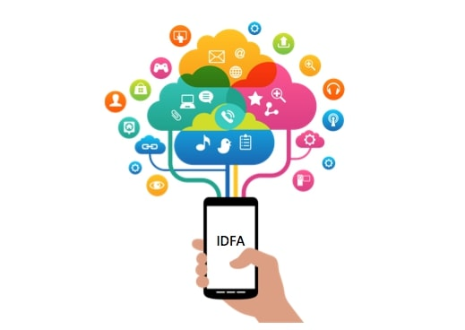

<div align="center">



</div>

2020년 초에 회사에서 IDFA를 수집하는 iOS 개발을 진행하였습니다.

이 때 경험하고 공부했던 내용을 공유하고자 합니다.

## 한명의 사용자를 식별하기 위하여

마케팅, 유저 활동, 지표 분석 등의 목적으로 하나의 앱에서 여러 `Analytics`을 사용하여 사용자 이벤트를 관찰합니다.

그렇기에 다양한 `Analytics`에서 수집되는 사용자 이벤트를 취합하여 분석하는 것을 필수적입니다.

따라 우리는 모든 `Analytics`가 `한명의 사용자를 식별할 수 있는 ID`를 관찰하도록 만들어야 합니다.

한명의 사용자가 방출한 모든 이벤트를 구분하여 취합하여야 하기 때문이죠.

## 다양한 Analytics에서 사용할 수 있는 USER_ID

모든 `Analytics`이 `한명의 사용자를 식별할 수 있는 ID`로 무엇을 사용하면 좋을까요?

❓ 서비스 내에서 자체적으로 발급하는 `USER_ID`는 어떤가요?

😩 사용자의 서비스 가입 및 앱 설치 유입 경로를 관찰하는 `Analytics`에서는 사용이 불가능합니다.

❓ 각 `Analytics`에서 발급하는 `USER_ID`는 어떤가요?

😩 허나 각각의 마케팅 툴에서 발급하는 `USER_ID (사용자를 식별할 수 있는 고유한 값)` 은 모두 다릅니다.

---
서비스, `Analytics`에서 발급하는 `USER_ID`로는 절대 사용자의 이벤트를 취합하고 분석하는 것은 불가능합니다.

위 문제를 해결하기 위하여 `주민등록번호`와 같이 신뢰할 수 있는 기관에서 발급하는 `USER_ID`가 필요합니다.

그리고  Apple 에서는 `IDFA (iOS 기기용 광고 식별자)`라는 것을 제공하고 있습니다.

### IDFA란

> Apple에서 제공하는 사용자의 기기를 식별할 수 있는 고유의 랜덤한 식별자입니다.

> The IDFA (Identity for Advertisers) is the individual and random identifier used by Apple to identify and measure iOS user devices.

모든 iOS 기기에는 하나의 고유한 `IDFA`가 내제되어 있습니다.

우리는 이를 통해 다양한 `Analytics`에서 수집되는 사용자 이벤트를 취합하여 분석할 수 있습니다.

## iOS에서 IDFA 가져오기

iOS에서는 IDFA를 가져오기 위해 우리는 `ASIdentifierManager`를 사용하여야 합니다.

```swift
import AdSupport

// IDFA 관련 값을 관장하는 Manager 클래스
// 꼭 `shared` 함수를 통해 Instance에 접근하세요
let manager = ASIdentifierManager.shared()

/*
 `isAdvertisingTrackingEnabled`를 통해 사용자가
 광고 추적 제한(LAT) 기능을 사용하고 있는지 확인할 수 있습니다.

 만약 사용자가 광고 추적 제한 기능을 켰다면
 `IDFA` 값은 `00000000-0000-0000-0000-000000000000` 으로 반환됩니다.
 */
guard manager.isAdvertisingTrackingEnabled else {
    return
}

// `advertisingIdentifier` 를 통하여 IDFA를 반환받을 수 있습니다.
// IDFA의 자료형은 UUID 값 입니다.
print(manager.advertisingIdentifier)

```

**❗️코드를 적용할 때 주의할 점❗️**

- IDFA를 사용할 때는 꼭 `광고 추적 제한` 으로 인해 관찰이 제한 될 수 있습니다.
- IDFA는 사용자의 요청에 따라 언제든지 재설정 될 수 있습니다.
- 앱 내에 IDFA를 사용코드가 있다면 앱 제출시 광고 식별자 사용 여부에 대해 답해야합니다. [Appstore Connect 가이드라인](https://help.apple.com/app-store-connect/#/dev301cb2b3e)

### 마치며
오늘 `IDFA`가 무엇이며 실제 코드에서 어떻게 사용되는지 간단하게 알아보았습니다.

위 Post 내용을 통해 `IDFA`가 어떠한 고통 & 문제 속에서 탄생하게 되었는지 알아가는 시간이 되었길 바랍니다.

### 참고 자료

[IDFA 관련 Apple 공식 문서](https://developer.apple.com/documentation/adsupport/asidentifiermanager)

[Appsflyer IDFA 관련 문서](https://support.appsflyer.com/hc/ko/articles/207032086-%EC%95%A0%ED%94%8C%EC%9D%98-%EC%83%88%EB%A1%9C%EC%9A%B4-IDFA-%EA%B0%80%EC%9D%B4%EB%93%9C%EB%9D%BC%EC%9D%B8-IDFA-%EA%B4%80%EB%A0%A8-iOS-%EC%95%B1-%EC%A0%9C%EC%B6%9C-%EB%B0%A9%EB%B2%95)

[Appstore Connect 가이드라인](https://help.apple.com/app-store-connect/#/dev301cb2b3e)

[Google Authorized Buyers Q&A](https://support.google.com/authorizedbuyers/answer/3221407?hl=ko)